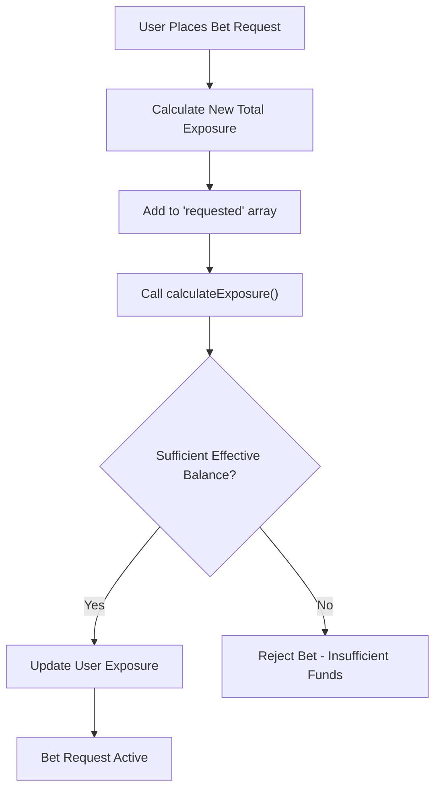
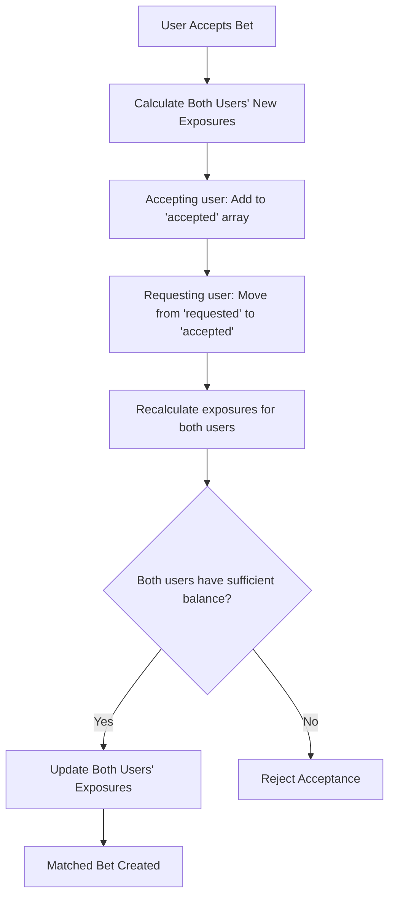
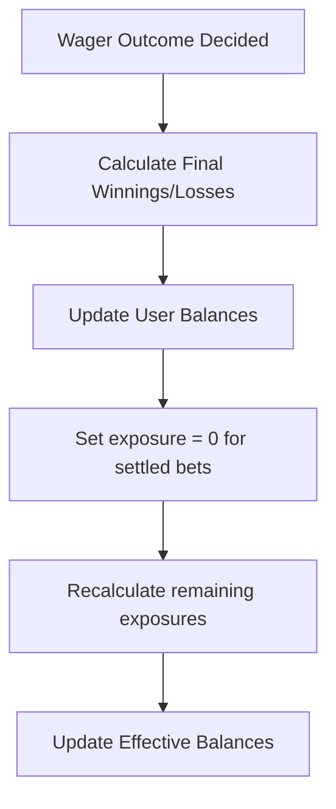

import Tabs from "@theme/Tabs";
import TabItem from "@theme/TabItem";

# Understanding Exposure Calculations

This guide explains how user exposures are calculated in the betting system and how they affect a user's ability to place new bets.

## What is Exposure?

**Exposure** represents the maximum potential loss a user could face from all their active betting positions. It's a crucial risk management metric that ensures users don't commit to bets they cannot afford to lose.

When a user places a bet offer, the system calculates the potential loss and "reserves" that amount as exposure, reducing their available balance for new bets.

## Basic Exposure Formula

```
Effective Balance = Current Balance - Total Exposure
```

A user can only place new bets if their effective balance is sufficient to cover the potential losses.

## How Exposure is Calculated

The exposure calculation is more sophisticated than a simple bet amount. It considers **both scenarios** (selection wins/loses) and calculates the **maximum potential loss** across all betting positions.

### Key Principles

1. **Two-Scenario Analysis**: The algorithm evaluates both "selection wins" and "selection loses" outcomes
2. **Net Position Calculation**: It considers the net effect across all betting positions
3. **Hard Floor of Zero**: Exposure can never be negative
4. **Maximum Loss Principle**: Exposure is the worst-case scenario between both outcomes

## Real-World Examples

### Example 1: Simple Requested Bet (Betting For)

**Scenario:** John requests to bet $100 on Team A at odds of 2.5

```typescript
const accepted = [];  // No accepted bets
const requested = [{ amount: 100, odds: 2.5 }];

// If Team A wins: John wins $150, loses nothing = net win $150  
// If Team A loses: John wins nothing, loses $100 = net loss $100
// Exposure = max(0, 100) = $100
```

**Result:** John's exposure is $100 (his stake)

### Example 2: Simple Accepted Bet (Betting Against)

**Scenario:** Sarah accepts someone's $100 bet on Team B at odds of 3.0

```typescript
const accepted = [{ amount: 100, odds: 3.0 }];  // Sarah accepts this bet
const requested = [];  // No requested bets

// If Team B wins: Sarah loses $200, wins nothing = net loss $200
// If Team B loses: Sarah wins $100, loses nothing = net win $100  
// Exposure = max(200, 0) = $200
```

**Result:** Sarah's exposure is $200 (potential payout)

### Example 3: Mixed Position (Hedging Scenario)

**Scenario:** Mike has both accepted and requested bets on the same selection

```typescript
const accepted = [{ amount: 100, odds: 2.5 }];   // Accepts bet against Team C
const requested = [{ amount: 80, odds: 2.2 }];   // Requests bet for Team C

// If Team C wins:
//   - Lose: 100 × (2.5-1) = $150 (from accepted)
//   - Win:  80 × (2.2-1) = $96 (from requested)  
//   - Net loss: $150 - $96 = $54

// If Team C loses:
//   - Win: $100 (from accepted)
//   - Lose: $80 (from requested)
//   - Net win: $100 - $80 = $20

// Exposure = max(54, 0) = $54
```

**Result:** Mike's exposure is $54 (hedging reduced his risk)

### Example 4: Perfect Hedge (Zero Exposure)

**Scenario:** Lisa creates a perfect hedge with equal and opposite positions

```typescript
const accepted = [{ amount: 100, odds: 2.0 }];
const requested = [{ amount: 100, odds: 2.0 }];

// If selection wins: Lose $100 - Win $100 = $0
// If selection loses: Win $100 - Lose $100 = $0
// Exposure = max(0, 0) = $0
```

**Result:** Lisa has zero exposure (perfect hedge)

## Exposure Lifecycle

### 1. Bet Placement (Request)


### 2. Bet Acceptance


### 3. Bet Settlement


## Advanced Exposure Scenarios

### Partial Bet Acceptance

When a bet offer is partially accepted, the system recalculates exposure based on the new bet distributions:

**Example:**
```typescript
// Original position
const originalRequested = [{ amount: 200, odds: 2.0 }];
const originalExposure = calculateExposure([], originalRequested); // 200

// After $80 is accepted
const newAccepted = [{ amount: 80, odds: 2.0 }];      // User now accepts $80
const newRequested = [{ amount: 120, odds: 2.0 }];    // $120 still requested

// Recalculate exposure
const newExposure = calculateExposure(newAccepted, newRequested);
// If wins: lose $80 - win $120 = win $40 (capped at 0)
// If loses: win $80 - lose $120 = lose $40  
// New exposure = max(0, 40) = $40
```

**Result:** Exposure reduced from $200 to $40 due to partial hedge effect

### Bet Cancellation

When a user cancels part of their bet offer, it's removed from the calculation:

**Example:**
```typescript
// Original position  
const originalRequested = [{ amount: 300, odds: 1.8 }];
const originalExposure = calculateExposure([], originalRequested); // 300

// After canceling $100
const newRequested = [{ amount: 200, odds: 1.8 }];  // Remove $100
const newExposure = calculateExposure([], newRequested); // 200

// Exposure reduction: 300 - 200 = $100 released
```

### Complex Multi-Bet Portfolio

**Real-world scenario with multiple bets:**

```typescript
const accepted = [
  { amount: 50, odds: 1.8 },   // Low-risk accepted bet
  { amount: 100, odds: 4.0 },  // High-risk accepted bet  
  { amount: 75, odds: 2.2 }    // Medium-risk accepted bet
];

const requested = [
  { amount: 80, odds: 2.5 },   // Medium requested bet
  { amount: 60, odds: 3.0 }    // Higher requested bet
];

// If selection wins:
// Lose: 50×0.8 + 100×3.0 + 75×1.2 = 40 + 300 + 90 = 430
// Win: 80×1.5 + 60×2.0 = 120 + 120 = 240  
// Net loss: 430 - 240 = 190

// If selection loses:
// Win: 50 + 100 + 75 = 225
// Lose: 80 + 60 = 140
// Net win: 225 - 140 = 85 (no loss)

// Exposure = max(190, 0) = $190
```

### Negative Balance Preferences

Some users may have `allow_negative_balance` preference enabled:

<Tabs>
  <TabItem value="disabled" label="Negative Balance Disabled (Default)">

```javascript
// Standard exposure check
if (effectiveBalance < requiredExposure) {
  throw new Error("Insufficient effective balance");
}

// Example
const user = {
  balance: 100,
  exposure: 80,
  preferences: { allow_negative_balance: false }
};

const effectiveBalance = 100 - 80; // = 20
const maxNewBet = 20; // Cannot bet more than $20
```

  </TabItem>
  <TabItem value="enabled" label="Negative Balance Enabled">

```javascript
// Relaxed exposure check - can go negative
// (Still subject to account-level limits)

// Example
const user = {
  balance: 100,
  exposure: 80,
  preferences: { allow_negative_balance: true }
};

// User can potentially bet beyond their current balance
// subject to account policy limits
```

  </TabItem>
</Tabs>

## API Response Examples

### User Balance with Exposure

When retrieving user details, you'll see both balance and exposure:

```json
{
  "data": {
    "id": 123,
    "name": "John Doe",
    "balance": 1000,
    "exposure": 350,
    "effective_balance": 650,
    "preferences": {
      "allow_negative_balance": false
    }
  }
}
```

### Insufficient Balance Error

When a bet is rejected due to insufficient effective balance:

```json
{
  "status": 400,
  "error": "Effective balance too low",
  "data": {
    "id": 123,
    "balance": 500,
    "exposure": 450,
    "effective_balance": 50,
    "preferences": {
      "allow_negative_balance": false
    },
    "account_preferences": {
      "allow_negative_balance": false
    }
  }
}
```

## Best Practices

### For Platform Operators

1. **Monitor User Exposure**: Keep track of users with high exposure ratios
2. **Set Exposure Limits**: Consider implementing maximum exposure limits
3. **Risk Management**: Use exposure data for risk assessment and user limits
4. **Real-time Updates**: Ensure exposure is updated immediately when bets are placed/settled

### For API Integration

1. **Check Effective Balance**: Always verify effective balance before allowing bet placement
2. **Handle Errors Gracefully**: Provide clear messaging when bets are rejected
3. **Real-time Balance**: Keep user balance information updated in your UI
4. **Exposure Breakdown**: Consider showing users their current exposure details

## Code Examples

### Calculating Exposure and Effective Balance

<Tabs groupId="programming-language">
  <TabItem value="javascript" label="JavaScript">

```javascript
// Core exposure calculation (matches BetsService.calculateExposure)
function calculateExposure(accepted, requested) {
  // Scenario 1: If selection wins
  const lossOnWinAccepted = accepted.reduce(
    (acc, bet) => acc + bet.amount * (bet.odds - 1), 0
  );
  const winOnWinRequested = requested.reduce(
    (acc, bet) => acc + bet.amount * (bet.odds - 1), 0
  );
  const lossOnSelectionWin = lossOnWinAccepted - winOnWinRequested;

  // Scenario 2: If selection loses
  const winOnLossAccepted = accepted.reduce((acc, bet) => acc + bet.amount, 0);
  const lossOnLossRequested = requested.reduce((acc, bet) => acc + bet.amount, 0);
  const lossOnSelectionLoss = lossOnLossRequested - winOnLossAccepted;

  // Return maximum potential loss (minimum 0)
  return Math.max(Math.max(lossOnSelectionWin, lossOnSelectionLoss), 0);
}

function calculateEffectiveBalance(user) {
  const { balance, exposure, preferences, account_preferences } = user;
  
  // Check if negative balance is allowed
  const allowNegative = preferences?.allow_negative_balance || 
                       account_preferences?.allow_negative_balance;
  
  const effectiveBalance = balance - exposure;
  
  return {
    effectiveBalance,
    canBet: allowNegative || effectiveBalance > 0,
    maxBetAmount: allowNegative ? Infinity : Math.max(0, effectiveBalance)
  };
}

// Example: Calculate exposure for a betting position
const accepted = [{ amount: 100, odds: 3.0 }];
const requested = [{ amount: 50, odds: 2.0 }];
const exposure = calculateExposure(accepted, requested);
console.log(`Exposure: $${exposure}`); // $50

// Example: Calculate effective balance
const user = {
  balance: 1000,
  exposure: 750,
  preferences: { allow_negative_balance: false }
};

const result = calculateEffectiveBalance(user);
console.log(`Effective Balance: $${result.effectiveBalance}`); // $250
console.log(`Max Bet Amount: $${result.maxBetAmount}`);       // $250
```

  </TabItem>
  <TabItem value="python" label="Python">

```python
def calculate_exposure(accepted, requested):
    """Calculate exposure using the same algorithm as BetsService.calculateExposure"""
    # Scenario 1: If selection wins
    loss_on_win_accepted = sum(bet['amount'] * (bet['odds'] - 1) for bet in accepted)
    win_on_win_requested = sum(bet['amount'] * (bet['odds'] - 1) for bet in requested)
    loss_on_selection_win = loss_on_win_accepted - win_on_win_requested
    
    # Scenario 2: If selection loses
    win_on_loss_accepted = sum(bet['amount'] for bet in accepted)
    loss_on_loss_requested = sum(bet['amount'] for bet in requested)
    loss_on_selection_loss = loss_on_loss_requested - win_on_loss_accepted
    
    # Return maximum potential loss (minimum 0)
    return max(max(loss_on_selection_win, loss_on_selection_loss), 0)

def calculate_effective_balance(user):
    """Calculate user's effective balance and betting capacity"""
    balance = user.get('balance', 0)
    exposure = user.get('exposure', 0)
    
    # Check negative balance permissions
    user_prefs = user.get('preferences', {})
    account_prefs = user.get('account_preferences', {})
    allow_negative = (user_prefs.get('allow_negative_balance', False) or 
                     account_prefs.get('allow_negative_balance', False))
    
    effective_balance = balance - exposure
    
    return {
        'effective_balance': effective_balance,
        'can_bet': allow_negative or effective_balance > 0,
        'max_bet_amount': float('inf') if allow_negative else max(0, effective_balance)
    }

# Example: Calculate exposure for a betting position
accepted = [{'amount': 100, 'odds': 3.0}]
requested = [{'amount': 50, 'odds': 2.0}]
exposure = calculate_exposure(accepted, requested)
print(f"Exposure: ${exposure}")  # $50

# Example: Calculate effective balance
user = {
    'balance': 1000,
    'exposure': 750,
    'preferences': {'allow_negative_balance': False}
}

result = calculate_effective_balance(user)
print(f"Effective Balance: ${result['effective_balance']}")  # $250
print(f"Max Bet Amount: ${result['max_bet_amount']}")        # $250
```

  </TabItem>
  <TabItem value="rust" label="Rust">

```rust
use serde::{Deserialize, Serialize};

#[derive(Debug, Clone)]
struct Bet {
    amount: f64,
    odds: f64,
}

#[derive(Deserialize)]
struct User {
    balance: f64,
    exposure: f64,
    preferences: Option<UserPreferences>,
    account_preferences: Option<AccountPreferences>,
}

#[derive(Deserialize)]
struct UserPreferences {
    allow_negative_balance: Option<bool>,
}

#[derive(Deserialize)]
struct AccountPreferences {
    allow_negative_balance: Option<bool>,
}

#[derive(Serialize)]
struct EffectiveBalanceResult {
    effective_balance: f64,
    can_bet: bool,
    max_bet_amount: f64,
}

/// Calculate exposure using the same algorithm as BetsService.calculateExposure
fn calculate_exposure(accepted: &[Bet], requested: &[Bet]) -> f64 {
    // Scenario 1: If selection wins
    let loss_on_win_accepted: f64 = accepted
        .iter()
        .map(|bet| bet.amount * (bet.odds - 1.0))
        .sum();
    
    let win_on_win_requested: f64 = requested
        .iter()
        .map(|bet| bet.amount * (bet.odds - 1.0))
        .sum();
    
    let loss_on_selection_win = loss_on_win_accepted - win_on_win_requested;
    
    // Scenario 2: If selection loses
    let win_on_loss_accepted: f64 = accepted.iter().map(|bet| bet.amount).sum();
    let loss_on_loss_requested: f64 = requested.iter().map(|bet| bet.amount).sum();
    let loss_on_selection_loss = loss_on_loss_requested - win_on_loss_accepted;
    
    // Return maximum potential loss (minimum 0)
    loss_on_selection_win.max(loss_on_selection_loss).max(0.0)
}

fn calculate_effective_balance(user: &User) -> EffectiveBalanceResult {
    let effective_balance = user.balance - user.exposure;
    
    // Check if negative balance is allowed
    let user_allows = user.preferences
        .as_ref()
        .and_then(|p| p.allow_negative_balance)
        .unwrap_or(false);
        
    let account_allows = user.account_preferences
        .as_ref()
        .and_then(|p| p.allow_negative_balance)
        .unwrap_or(false);
    
    let allow_negative = user_allows || account_allows;
    
    EffectiveBalanceResult {
        effective_balance,
        can_bet: allow_negative || effective_balance > 0.0,
        max_bet_amount: if allow_negative { 
            f64::INFINITY 
        } else { 
            effective_balance.max(0.0) 
        },
    }
}

// Example usage
fn main() {
    // Example: Calculate exposure for a betting position
    let accepted = vec![Bet { amount: 100.0, odds: 3.0 }];
    let requested = vec![Bet { amount: 50.0, odds: 2.0 }];
    let exposure = calculate_exposure(&accepted, &requested);
    println!("Exposure: ${}", exposure); // $50.0
    
    // Example: Calculate effective balance
    let user = User {
        balance: 1000.0,
        exposure: 750.0,
        preferences: Some(UserPreferences {
            allow_negative_balance: Some(false),
        }),
        account_preferences: None,
    };
    
    let result = calculate_effective_balance(&user);
    println!("Effective Balance: ${}", result.effective_balance); // $250
    println!("Max Bet Amount: ${}", result.max_bet_amount);       // $250
}
```

  </TabItem>
</Tabs>

## Monitoring and Debugging

### Common Issues

1. **Unexpected Bet Rejections**: Check if user has sufficient effective balance
2. **Balance Discrepancies**: Verify that exposure calculations are correct
3. **Stuck Exposure**: Ensure exposures are properly released when bets are settled

### Debugging Checklist

- ✅ Verify current user balance
- ✅ Calculate total active exposure
- ✅ Check user and account negative balance preferences
- ✅ Confirm bet amount requirements
- ✅ Review recent bet history for unsettled positions

## Key Implementation Insights

### Critical Properties

Based on the actual `BetsService.calculateExposure()` implementation, here are the critical properties that ensure system integrity:

1. **Non-Negative Exposure**: The `Math.max(..., 0)` ensures exposure can never be negative, which is fundamental to preventing accounting anomalies.

2. **Two-Scenario Analysis**: The algorithm evaluates both win and lose scenarios to find the true worst-case exposure, not just a simple stake calculation.

3. **Net Position Consideration**: The system considers the net effect of all betting positions, allowing for natural hedging when users have both accepted and requested bets.

4. **Mathematical Proof of Safety**: The hard floor of zero mathematically guarantees that total user exposure across the platform cannot become negative.

### Real Implementation Examples from Tests

The test suite reveals several important scenarios:

```javascript
// Perfect Hedge - Zero Exposure
const accepted = [{ amount: 100, odds: 2.0 }];
const requested = [{ amount: 100, odds: 2.0 }];
// Result: 0 (both scenarios cancel out)

// Arbitrage Detection
const accepted = [{ amount: 100, odds: 2.1 }];
const requested = [{ amount: 90, odds: 2.2 }]; 
// Result: 2 (minimal exposure on profitable positions)

// High-Risk Scenario  
const accepted = [{ amount: 10, odds: 50.0 }];
const requested = [];
// Result: 490 (maximum potential payout)
```

### Platform Safety Guarantees

This implementation provides several safety guarantees:

- **No Negative Exposure**: Users cannot have negative exposure due to the Math.max floor
- **Accurate Risk Assessment**: Two-scenario analysis provides true worst-case calculations
- **Hedge Recognition**: System naturally reduces exposure when users hedge positions
- **Mathematical Consistency**: The algorithm ensures consistent exposure calculations across all bet combinations

Understanding exposure calculations is crucial for both risk management and user experience. By properly implementing these concepts, you can ensure your betting platform operates safely while providing users with clear information about their available betting capacity.