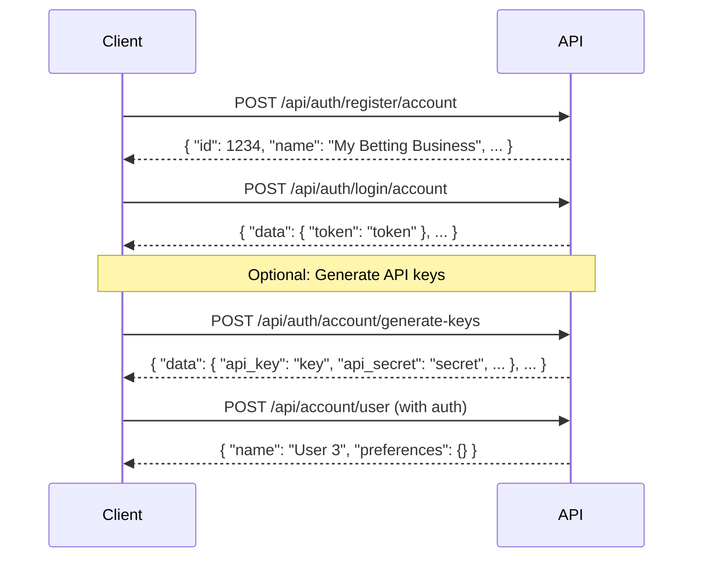

import Tabs from "@theme/Tabs";
import TabItem from "@theme/TabItem";

# User Management

This guide will take you through the journey of managing users within your betting application using our API.

## Creating a User

Once you have authenticated, you can create users who will be placing bets on your platform. To create a user, you need to send a POST request to our API with the user's details. The `reference` field is optional and will be generated if not provided. The `preferences` field is also optional.

<Tabs groupId="programming-language">
  <TabItem value="curl" label="cURL">

```bash
# Using token authentication
curl -X POST "$baseUrl/api/account/user" \
  -H "Authorization: Bearer $token" \
  -H "Content-Type: application/json" \
  -d '{
    "reference": "danny_user",  # Optional
    "name": "User 3",
    "preferences": {}  # Optional
  }'

# Or using API key authentication
curl -X POST "$baseUrl/api/account/user" \
  -H "Authorization: Basic $base64_encoded" \
  -H "Content-Type: application/json" \
  -d '{
    "reference": "danny_user",  # Optional
    "name": "User 3",
    "preferences": {}  # Optional
  }'
```

  </TabItem>
  <TabItem value="javascript" label="JavaScript">

```javascript
const createUser = async (auth) => {
  try {
    // Determine authentication method
    let authHeader;
    if (auth.token) {
      authHeader = `Bearer ${auth.token}`;
    } else if (auth.apiKeys) {
      authHeader = `Basic ${auth.apiKeys.base64_encoded}`;
    }

    const response = await fetch(`${baseUrl}/api/account/user`, {
      method: "POST",
      headers: {
        Authorization: authHeader,
        "Content-Type": "application/json",
      },
      body: JSON.stringify({
        reference: "danny_user", // Optional
        name: "User 3",
        preferences: {}, // Optional
      }),
    });

    const data = await response.json();
    console.log("User created:", data);
  } catch (error) {
    console.error("Error creating user:", error);
  }
};

// Usage
const auth = await getAuthentication();
createUser(auth);
```

  </TabItem>
  <TabItem value="python" label="Python">

```python
import requests
import json

def create_user(auth):
    url = f"{baseUrl}/api/account/user"

    headers = {
        'Content-Type': 'application/json'
    }

    # Determine authentication method
    if 'token' in auth:
        headers['Authorization'] = f"Bearer {auth['token']}"
    elif 'apiKeys' in auth:
        headers['Authorization'] = f"Basic {auth['apiKeys']['base64_encoded']}"

    payload = {
        "reference": "danny_user",  # Optional
        "name": "User 3",
        "preferences": {}  # Optional
    }

    response = requests.post(url, headers=headers, data=json.dumps(payload))

    if response.status_code == 200:
        print('User created:', response.json())
    else:
        print('Error creating user:', response.text)

# Usage
auth = get_authentication()
create_user(auth)
```

  </TabItem>
  <TabItem value="rust" label="Rust">

```rust
use reqwest::Client;
use serde::{Deserialize, Serialize};

#[derive(Serialize)]
struct UserRequest {
  reference: Option<String>,
  name: String,
  preferences: Option<serde_json::Value>,
}

enum AuthMethod {
  Token(String),
  ApiKeys(ApiKeys),
}

async fn create_user(client: &Client, base_url: &str, auth: &AuthMethod)
-> Result<serde_json::Value, Box<dyn std::error::Error>> {

  let mut request_builder = client
      .post(&format!("{}/api/account/user", base_url))
      .header("Content-Type", "application/json");

  // Apply authentication header
  match auth {
      AuthMethod::Token(token) => {
          request_builder = request_builder.header("Authorization", format!("Bearer {}", token));
      },
      AuthMethod::ApiKeys(api_keys) => {
          request_builder = request_builder.header("Authorization", format!("Basic {}", api_keys.base64_encoded));
      }
  }

  let user_request = UserRequest {
      reference: Some("danny_user".to_string()), // Optional
      name: "User 3".to_string(),
      preferences: Some(serde_json::json!({})), // Optional
  };

  let response = request_builder
      .json(&user_request)
      .send()
      .await?;

  let user_data = response.json::<serde_json::Value>().await?;
  println!("User created: {:?}", user_data);

  Ok(user_data)
}

#[tokio::main]
async fn main() -> Result<(), Box<dyn std::error::Error>> {
let client = Client::new();

  // First get authentication (token or API keys)
  // ...

  // Create user with token
  let auth = AuthMethod::Token(token);
  let user_data = create_user(&client, baseUrl, &auth).await?;

  // Or create user with API keys
  // let auth = AuthMethod::ApiKeys(api_keys);
  // let user_data = create_user(&client, baseUrl, &auth).await?;

  Ok(())
}
```

  </TabItem>
</Tabs>

Upon successful creation, the API will respond with the user's details:

```json
{
  "data": {
    "id": 1,
    "reference": "a1_user_FclirLc2MJecJqsi"
  },
  "message": "User created successfully"
}
```

### Flow of Creating a User

Here is a visual representation of the flow for creating a user:



This diagram shows the complete sequence of API calls to create an account, authenticate, and then create a user.

## Getting User Details

You can retrieve the details of a specific user by sending a GET request to our API with either the user's ID or reference.

### By User ID

<Tabs groupId="programming-language">
  <TabItem value="curl" label="cURL">

```bash
# Using token authentication
curl -X GET "$baseUrl/api/account/user/$userId" \
  -H "Authorization: Bearer $token" \
  -H "Content-Type: application/json"

# Or using API key authentication
curl -X GET "$baseUrl/api/account/user/$userId" \
  -H "Authorization: Basic $base64_encoded" \
  -H "Content-Type: application/json"
```

  </TabItem>
  <TabItem value="javascript" label="JavaScript">

```javascript
const getUserDetailsById = async (auth, userId) => {
  try {
    // Determine authentication method
    let authHeader;
    if (auth.token) {
      authHeader = `Bearer ${auth.token}`;
    } else if (auth.apiKeys) {
      authHeader = `Basic ${auth.apiKeys.base64_encoded}`;
    }

    const response = await fetch(`${baseUrl}/api/account/user/${userId}`, {
      method: "GET",
      headers: {
        Authorization: authHeader,
        "Content-Type": "application/json",
      },
    });

    const data = await response.json();
    console.log("User details:", data);
  } catch (error) {
    console.error("Error getting user details:", error);
  }
};

// Usage
const auth = await getAuthentication();
const userId = "1"; // Replace with actual user ID
getUserDetailsById(auth, userId);
```

  </TabItem>
  <TabItem value="python" label="Python">

```python
import requests

def get_user_details_by_id(auth, user_id):
    url = f"{baseUrl}/api/account/user/{user_id}"

    headers = {
        'Content-Type': 'application/json'
    }

    # Determine authentication method
    if 'token' in auth:
        headers['Authorization'] = f"Bearer {auth['token']}"
    elif 'apiKeys' in auth:
        headers['Authorization'] = f"Basic {auth['apiKeys']['base64_encoded']}"

    response = requests.get(url, headers=headers)

    if response.status_code == 200:
        print('User details:', response.json())
    else:
        print('Error getting user details:', response.text)

# Usage
auth = get_authentication()
user_id = '1' # Replace with actual user ID
get_user_details_by_id(auth, user_id)
```

  </TabItem>
  <TabItem value="rust" label="Rust">

```rust
use reqwest::Client;
use serde_json::Value;

enum AuthMethod {
  Token(String),
  ApiKeys(ApiKeys),
}

async fn get_user_details_by_id(client: &Client, base_url: &str, auth: &AuthMethod, user_id: &str)
-> Result<Value, Box<dyn std::error::Error>> {

  let mut request_builder = client
      .get(&format!("{}/api/account/user/{}", base_url, user_id))
      .header("Content-Type", "application/json");

  // Apply authentication header
  match auth {
      AuthMethod::Token(token) => {
          request_builder = request_builder.header("Authorization", format!("Bearer {}", token));
      },
      AuthMethod::ApiKeys(api_keys) => {
          request_builder = request_builder.header("Authorization", format!("Basic {}", api_keys.base64_encoded));
      }
  }

  let response = request_builder.send().await?;
  let user_data = response.json::<Value>().await?;
  println!("User details: {:?}", user_data);

  Ok(user_data)
}

#[tokio::main]
async fn main() -> Result<(), Box<dyn std::error::Error>> {
let client = Client::new();

  // First get authentication (token or API keys)
  // ...

  // Get user details with token
  let auth = AuthMethod::Token(token);
  let user_data = get_user_details_by_id(&client, baseUrl, &auth, "1").await?;

  // Or get user details with API keys
  // let auth = AuthMethod::ApiKeys(api_keys);
  // let user_data = get_user_details_by_id(&client, baseUrl, &auth, "1").await?;

  Ok(())
}
```

  </TabItem>
</Tabs>

### By User Reference

<Tabs groupId="programming-language">
  <TabItem value="curl" label="cURL">

```bash
# Using token authentication
curl -X GET "$baseUrl/api/account/user/reference/$reference" \
  -H "Authorization: Bearer $token" \
  -H "Content-Type: application/json"

# Or using API key authentication
curl -X GET "$baseUrl/api/account/user/reference/$reference" \
  -H "Authorization: Basic $base64_encoded" \
  -H "Content-Type: application/json"
```

  </TabItem>
  <TabItem value="javascript" label="JavaScript">

```javascript
const getUserDetailsByReference = async (auth, reference) => {
  try {
    // Determine authentication method
    let authHeader;
    if (auth.token) {
      authHeader = `Bearer ${auth.token}`;
    } else if (auth.apiKeys) {
      authHeader = `Basic ${auth.apiKeys.base64_encoded}`;
    }

    const response = await fetch(
      `${baseUrl}/api/account/user/reference/${reference}`,
      {
        method: "GET",
        headers: {
          Authorization: authHeader,
          "Content-Type": "application/json",
        },
      },
    );

    const data = await response.json();
    console.log("User details:", data);
  } catch (error) {
    console.error("Error getting user details:", error);
  }
};

// Usage
const auth = await getAuthentication();
const reference = "danny_user"; // Replace with actual user reference
getUserDetailsByReference(auth, reference);
```

  </TabItem>
  <TabItem value="python" label="Python">

```python
import requests

def get_user_details_by_reference(auth, reference):
    url = f"{baseUrl}/api/account/user/reference/{reference}"

    headers = {
        'Content-Type': 'application/json'
    }

    # Determine authentication method
    if 'token' in auth:
        headers['Authorization'] = f"Bearer {auth['token']}"
    elif 'apiKeys' in auth:
        headers['Authorization'] = f"Basic {auth['apiKeys']['base64_encoded']}"

    response = requests.get(url, headers=headers)

    if response.status_code == 200:
        print('User details:', response.json())
    else:
        print('Error getting user details:', response.text)

# Usage
auth = get_authentication()
reference = 'danny_user' # Replace with actual user reference
get_user_details_by_reference(auth, reference)
```

  </TabItem>
  <TabItem value="rust" label="Rust">

```rust
use reqwest::Client;
use serde_json::Value;

enum AuthMethod {
  Token(String),
  ApiKeys(ApiKeys),
}

async fn get_user_details_by_reference(client: &Client, base_url: &str, auth: &AuthMethod, reference: &str)
-> Result<Value, Box<dyn std::error::Error>> {

  let mut request_builder = client
      .get(&format!("{}/api/account/user/reference/{}", base_url, reference))
      .header("Content-Type", "application/json");

  // Apply authentication header
  match auth {
      AuthMethod::Token(token) => {
          request_builder = request_builder.header("Authorization", format!("Bearer {}", token));
      },
      AuthMethod::ApiKeys(api_keys) => {
          request_builder = request_builder.header("Authorization", format!("Basic {}", api_keys.base64_encoded));
      }
  }

  let response = request_builder.send().await?;
  let user_data = response.json::<Value>().await?;
  println!("User details: {:?}", user_data);

  Ok(user_data)
}

#[tokio::main]
async fn main() -> Result<(), Box<dyn std::error::Error>> {
let client = Client::new();

  // First get authentication (token or API keys)
  // ...

  // Get user details with token
  let auth = AuthMethod::Token(token);
  let user_data = get_user_details_by_reference(&client, baseUrl, &auth, "danny_user").await?;

  // Or get user details with API keys
  // let auth = AuthMethod::ApiKeys(api_keys);
  // let user_data = get_user_details_by_reference(&client, baseUrl, &auth, "danny_user").await?;

  Ok(())
}
```

  </TabItem>
</Tabs>

Upon successful retrieval, the API will respond with the user's details:

```json
{
  "data": {
    "id": 1,
    "reference": "a1_user_FclirLc2MJecJqsi",
    "name": "User 3",
    "preferences": {}
  },
  "message": "User details retrieved successfully"
}
```

The API will respond with the user's details:

```json
{
  "data": {
    "id": 1,
    "account_id": 1,
    "reference": "a1_user_FclirLc2MJecJqsi",
    "name": "User 3",
    "role": "user",
    "preferences": null,
    "balance": 1000,
    "exposure": 0
  },
  "message": "User fetched successfully"
}
```
